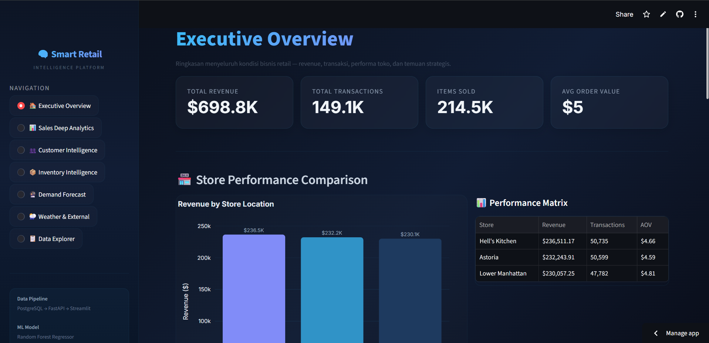
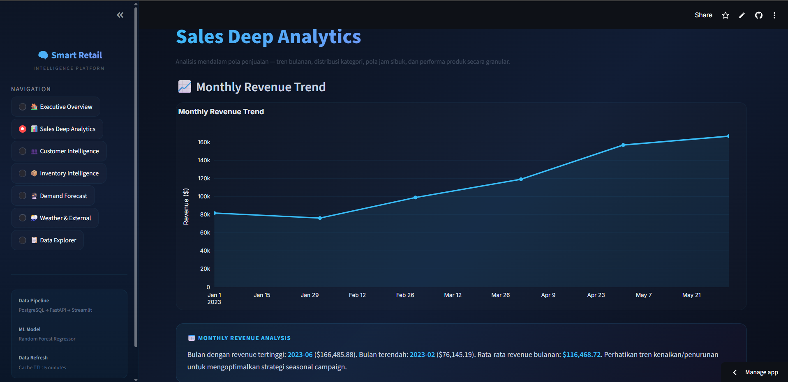
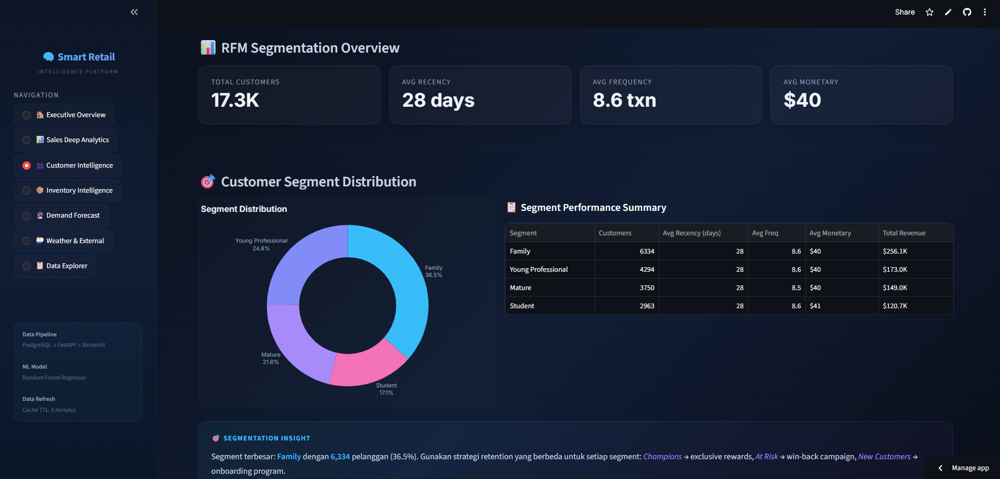
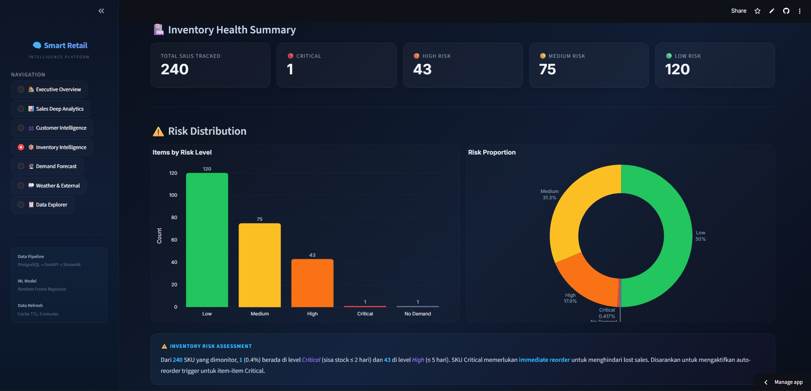
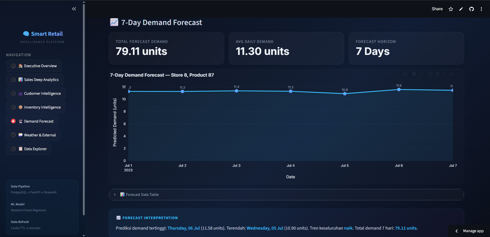
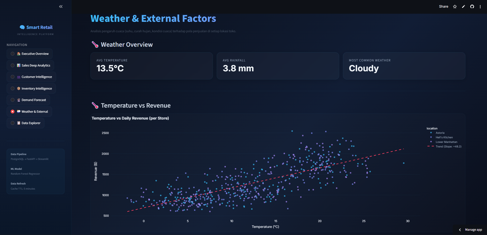
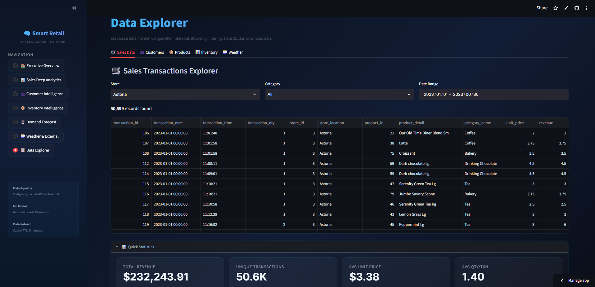
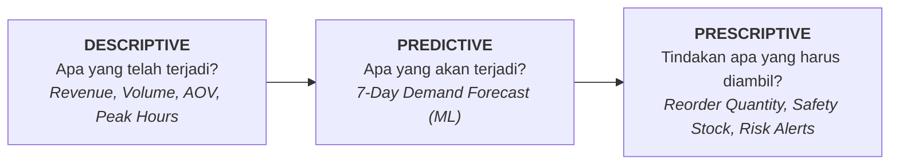
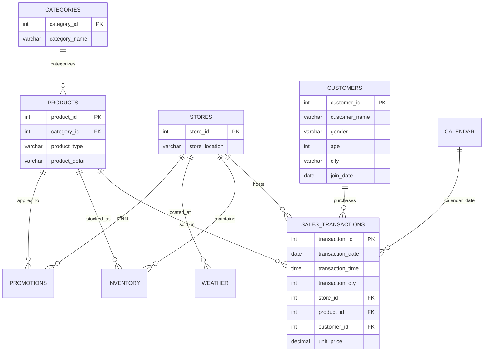
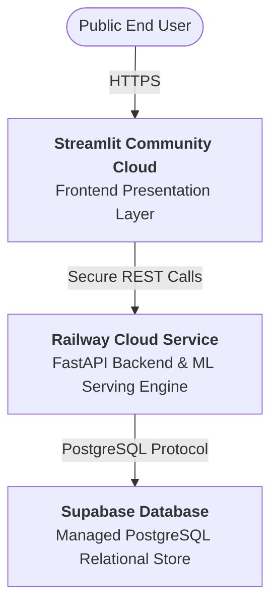

#  Smart Retail Intelligence Platform
### *End-to-End Enterprise Analytics, Customer Intelligence, Demand Forecasting & Inventory Optimization Engine*

[](https://python.org)
[](https://fastapi.tiangolo.com)
[](https://streamlit.io)
[](https://supabase.com)
[](https://scikit-learn.org)
[](https://railway.app)
[](LICENSE)

---

##  Live Demonstrations & Links

-  **Interactive Dashboard (Streamlit Cloud):** [smart-retail-intelligenceee.streamlit.app](https://smart-retail-intelligenceee.streamlit.app/)
-  **Interactive API Docs (FastAPI Swagger):** [smart-retail-intelligence-production.up.railway.app/docs](https://smart-retail-intelligence-production.up.railway.app/docs)
-  **Source Repository:** [github.com/lutfiindraa/smart-retail-intelligence](https://github.com/lutfiindraa/smart-retail-intelligence)

---

##  Application Showcase

|  Executive Overview |  Sales Deep Analytics |
|:---:|:---:|
| <br><sub>*Executive KPIs, Store Performance, & Revenue Breakdown*</sub> | <br><sub>*Monthly Trends, Hourly Heatmaps, & Day-of-Week Patterns*</sub> |

|  Customer Intelligence |  Inventory Intelligence |
|:---:|:---:|
| <br><sub>*3D RFM Segmentation & High-Value Retention Profiling*</sub> | <br><sub>*Stock Coverage, Stockout Risk Matrix, & Critical Alerts*</sub> |

|  Demand Forecasting |  Weather & External Factors |
|:---:|:---:|
| <br><sub>*Recursive 7-Day ML Prediction & Dynamic Reorder Engine*</sub> | <br><sub>*Environmental Correlation & Promotion Uplift Analysis*</sub> |

<details>
<summary><b> Klik untuk melihat Preview Data Explorer</b></summary>

| 📋 Interactive Data Explorer |
|:---:|
| <br><sub>*Multi-table Data Exploration, Granular Filtering & Direct CSV Export*</sub> |

</details>

---

##  Daftar Isi (Table of Contents)

1. [Ringkasan Eksekutif & Problem Statement](#1-ringkasan-eksekutif--problem-statement)
   - [1.1 Latar Belakang & Tantangan Bisnis](#11-latar-belakang--tantangan-bisnis)
   - [1.2 Framework Analitik 3 Tingkat](#12-framework-analitik-3-tingkat)
2. [Arsitektur Sistem & Tech Stack](#2-arsitektur-sistem--tech-stack)
   - [2.1 End-to-End Pipeline Architecture](#21-end-to-end-pipeline-architecture)
   - [2.2 Technology Stack Matrix](#22-technology-stack-matrix)
3. [Data Engineering & Relational Modeling](#3-data-engineering--relational-modeling)
   - [3.1 Dataset Profiling & Validasi Mutu](#31-dataset-profiling--validasi-mutu)
   - [3.2 Pipeline ETL](#32-pipeline-etl)
   - [3.3 Skema Relasional & ERD](#33-skema-relasional--erd)
   - [3.4 Data Enrichment Sintetis](#34-data-enrichment-sintetis)
4. [Business Intelligence & Sales Analytics](#4-business-intelligence--sales-analytics)
   - [4.1 Executive Sales Metrics](#41-executive-sales-metrics)
   - [4.2 Store & Category Dynamics](#42-store--category-dynamics)
   - [4.3 Temporal Trends & Peak Hours](#43-temporal-trends--peak-hours)
5. [Customer Intelligence & Segmentasi RFM](#5-customer-intelligence--segmentasi-rfm)
   - [5.1 Metodologi RFM & Scoring](#51-metodologi-rfm--scoring)
   - [5.2 Distribusi Segmen & Kontribusi Nilai](#52-distribusi-segmen--kontribusi-nilai)
6. [Demand Forecasting & Machine Learning](#6-demand-forecasting--machine-learning)
   - [6.1 Cartesian Grid & Feature Engineering](#61-cartesian-grid--feature-engineering)
   - [6.2 Validasi Model & Benchmark Performa](#62-validasi-model--benchmark-performa)
   - [6.3 Analisis Feature Importance](#63-analisis-feature-importance)
7. [Prescriptive Inventory Intelligence](#7-prescriptive-inventory-intelligence)
   - [7.1 Stock Coverage & Klasifikasi Risiko](#71-stock-coverage--klasifikasi-risiko)
   - [7.2 Algoritma Safety Stock & Rekomendasi Reorder](#72-algoritma-safety-stock--rekomendasi-reorder)
8. [FastAPI Backend & REST Services](#8-fastapi-backend--rest-services)
   - [8.1 Katalog Endpoint API](#81-katalog-endpoint-api)
   - [8.2 Alur Inferensi Rekursif](#82-alur-inferensi-rekursif)
9. [Streamlit Interactive Dashboard](#9-streamlit-interactive-dashboard)
10. [Cloud Deployment & Topology](#10-cloud-deployment--topology)
    - [10.1 3-Tier Production Architecture](#101-3-tier-production-architecture)
    - [10.2 Manajemen Environment Variables](#102-manajemen-environment-variables)
11. [Struktur Direktori Project](#11-struktur-direktori-project)
12. [Panduan Instalasi & Local Setup](#12-panduan-instalasi--local-setup)
13. [Batasan Teknis & Roadmap Pengembangan](#13-batasan-teknis--roadmap-pengembangan)
    - [13.1 Honest Limitations](#131-honest-limitations)
    - [13.2 Roadmap Masa Depan](#132-roadmap-masa-depan)
14. [Lisensi & Author](#14-lisensi--author)

---

## 1. Ringkasan Eksekutif & Problem Statement

### 1.1 Latar Belakang & Tantangan Bisnis
Operasional retail modern menghadapi tantangan kompleks dalam menjembatani kesenjangan antara **data transaksi historis** dengan **tindakan bisnis nyata**. Sering kali terjadi:
- **Ketidakseimbangan Stok:** Terjadinya *stockout* pada produk laris yang mengakibatkan *lost sales*, serta *overstocking* pada produk slow-moving yang meningkatkan *holding cost*.
- **Kurangnya Visibilitas Pelanggan:** Transaksi terjadi secara anonim tanpa identifikasi segmen bernilai tinggi (*champions*) vs pelanggan berisiko churn (*at-risk*).
- **Keputusan Reorder Reaktif:** Pengadaan barang masih mengandalkan intuisi manajer toko, tanpa estimasi kebutuhan masa depan (*demand forecasting*).

**Smart Retail Intelligence** dibangun sebagai solusi terintegrasi *production-grade* yang mengubah raw transactional logs menjadi ekosistem analitik terpadu: dari pemodelan data relasional, analitik SQL, segmentasi pelanggan RFM, machine learning forecasting, hingga rekomendasi reorder otomatis.

### 1.2 Framework Analitik 3 Tingkat



| Level Analitik | Pertanyaan Bisnis | Output Sistem |
|---|---|---|
| **Descriptive** | *Produk & cabang mana yang menyumbang pendapatan terbesar?* | Executive KPI Cards, Breakdown Kategori, Hourly Trend Matrix |
| **Predictive** | *Berapa proyeksi permintaan SKU $X$ di Store $Y$ selama 7 hari ke depan?* | Recursive Multi-Step Random Forest Forecast |
| **Prescriptive** | *Berapa unit persediaan yang harus dipesan kembali hari ini?* | Dynamic Safety Stock & Automated Reorder Recommendation |

---

## 2. Arsitektur Sistem & Tech Stack

### 2.1 End-to-End Pipeline Architecture

```
                                  ┌────────────────────────┐
                                  │   RAW TRANSACTIONS     │
                                  │   (149,116 CSV Rows)   │
                                  └───────────┬────────────┘
                                              │
                                              ▼
                                  ┌────────────────────────┐
                                  │     ETL PIPELINE       │
                                  │ • Schema Validation    │
                                  │ • Referential Integrity│
                                  │ • Synthetic Enrichment │
                                  └───────────┬────────────┘
                                              │
                                              ▼
                                  ┌────────────────────────┐
                                  │  POSTGRESQL (SUPABASE) │
                                  │ 8 Normalized Relational│
                                  │ Tables + Primary/FKs   │
                                  └─────┬────────────┬─────┘
                                        │            │
                         ┌──────────────┘            └──────────────┐
                         ▼                                          ▼
            ┌────────────────────────┐                 ┌────────────────────────┐
            │ SQL & PYTHON ANALYTICS │                 │ MACHINE LEARNING LAYER │
            │ • Sales & AOV Insights │                 │ • Time-Series Features │
            │ • RFM Segmentation     │                 │ • Random Forest Regress│
            │ • Weather/Promo Impact │                 │ • Recursive Multi-Step │
            └────────────┬───────────┘                 └────────────┬───────────┘
                         │                                          │
                         └──────────────┬───────────────────────────┘
                                        │
                                        ▼
                                  ┌────────────────────────┐
                                  │  FASTAPI REST BACKEND  │
                                  │ • High-performance API│
                                  │ • Pydantic Validations │
                                  │ • Real-time ML Serving │
                                  └───────────┬────────────┘
                                              │ HTTPS / JSON
                                              ▼
                                  ┌────────────────────────┐
                                  │  STREAMLIT DASHBOARD   │
                                  │ • Executive Overview   │
                                  │ • 3D Customer RFM      │
                                  │ • Interactive Forecast │
                                  │ • Inventory Health Desk│
                                  └────────────────────────┘
```

### 2.2 Technology Stack Matrix

| Domain | Teknologi / Framework | Fungsi Utama |
|---|---|---|
| **Core & Processing** | Python 3.11, Pandas, NumPy | Pembersihan data, transformasi, komputasi matriks |
| **Database & Modeling** | PostgreSQL, Supabase, SQLAlchemy | Penyimpanan relasional terstruktur dengan integritas referensial FK/PK |
| **Machine Learning** | Scikit-Learn, Joblib | Random Forest Regressor, Time-based lag/rolling feature engineering |
| **Backend REST API** | FastAPI, Uvicorn, Pydantic | API endpoints asynchronous, model inference service, validasi skema |
| **Frontend Dashboard** | Streamlit, Plotly Express/Graph Objects | Dark-mode glassmorphic interface, visualisasi 3D, filter interaktif |
| **Cloud Infrastructure** | Streamlit Cloud, Railway, Supabase, GitHub | Arsitektur cloud 3-tier terisolasi dengan SSL & environment secrets |

---

## 3. Data Engineering & Relational Modeling

### 3.1 Dataset Profiling & Validasi Mutu
Data transaksi mentah terdiri dari **149,116 catatan transaksi** (1 Januari 2023 – 30 Juni 2023) mencakup **80 produk unik**, **3 cabang toko retail**, dan **9 kategori produk**.

```text
Atribut Raw Data : transaction_id, transaction_date, transaction_time, transaction_qty, 
                   store_id, store_location, product_id, unit_price, product_category, 
                   product_type, product_detail
```

Pipeline ETL menerapkan 10 kriteria validasi ketat sebelum pemuatan ke database:
1. `transaction_id` berstatus unik 100% tanpa nilai duplikat.
2. Tidak ada *missing value* pada seluruh atribut utama.
3. Kuantitas transaksi valid ($qty \ge 1$) dan harga satuan positif ($price > 0$).
4. Konsistensi relasi antara Master Toko, Master Produk, dan Master Kategori.
5. Integritas foreign key terverifikasi secara ketat.

### 3.2 Pipeline ETL
Pipeline ETL diorganisasikan secara modular dalam direktori `etl/`:
- `01_transform_sales.py`: Normalisasi tabel raw menjadi entitas `categories`, `stores`, `products`, dan `sales_transactions`.
- `02_generate_customers.py` & `03_assign_customers.py`: Pembentukan 20,000 basis customer sintetis dengan konsistensi demografi toko.
- `04_generate_calendar.py` – `07_generate_weather.py`: Pembangkitan data enrichment untuk kalender operasional, promosi, stok inventaris, dan cuaca.

### 3.3 Skema Relasional & ERD



### 3.4 Data Enrichment Sintetis
Untuk memperluas kapabilitas dari sekadar analisis transaksi menjadi platform inteligensi retail:
- **Customer Master:** 20,000 profil pelanggan dengan aturan assignment logis (lokasi toko, skor keaktifan, join date $\le$ transaction date).
- **Calendar:** 181 hari historis + 31 hari forecast extension dengan penanda hari kerja, weekend, dan posisi kalender.
- **Inventory Ledger:** 43,440 baris agregasi harian ($181 \text{ hari} \times 3 \text{ toko} \times 80 \text{ produk}$) mencatat opening stock, received, sold, closing, dan stockout flag.
- **Promotions & Weather:** 54 program promosi dan log cuaca harian (suhu, curah hujan mm, kondisi cuaca).

---

## 4. Business Intelligence & Sales Analytics

### 4.1 Executive Sales Metrics

$$\text{Total Revenue: } \mathbf{\$698,812.33} \quad\vert\quad \text{Transactions: } \mathbf{149,116} \quad\vert\quad \text{Items Sold: } \mathbf{214,470} \quad\vert\quad \text{AOV: } \mathbf{\$4.69}$$

### 4.2 Store & Category Dynamics

| Store Location | Total Revenue | Transactions | Items Sold | Average Order Value (AOV) |
|---|---:|---:|---:|---:|
| **Hell's Kitchen** | **$236,511.17** | 50,735 | 73,086 | $4.66 |
| **Astoria** | $232,243.91 | **50,599** | 71,595 | $4.59 |
| **Lower Manhattan** | $230,057.25 | 47,782 | 69,789 | **$4.81** *(Highest AOV)* |

> 💡 **Strategic Insight:** Meskipun Hell's Kitchen memimpin total revenue kotor, **Lower Manhattan mencatatkan AOV tertinggi ($4.81)**, menjadikannya target paling ideal untuk strategi *premium basket upselling*.

```
KONTRIBUSI REVENUE BERDASARKAN KATEGORI:
├──  Coffee             : 38.63%  ($270,000+)  ─────────┐ 66.74% Pendapatan
├──  Tea                : 28.11%  ($196,000+)  ─────────┘ Ditopang oleh Beverage
├──  Bakery             : 11.78%  ($82,000+)
├──  Drinking Chocolate : 10.36%  ($72,000+)
└──  Others (5 Cat)     : 11.12%  ($77,000+)
```

### 4.3 Temporal Trends & Peak Hours
- **Pertumbuhan Bulanan:** Tren penjualan meningkat signifikan dari Januari (\$81.6K) ke Juni (\$166.5K), membukukan lonjakan **+118.6%**.
- **Jam Sibuk (Peak Hour):** Puncak transaksi terkonsentrasi pada pukul **08:00 – 10:00 pagi** dengan total **53,963 transaksi** (Puncak absolut: Jam 10:00 sebanyak 18,545 tx).
- **Distribusi Hari:** Pendapatan tertinggi terjadi pada hari **Senin (\$101,677.28)** dan terendah pada hari **Sabtu (\$96,894.48)**, membuktikan karakteristik *commuter-driven morning coffee retail*.

---

## 5. Customer Intelligence & Segmentasi RFM

### 5.1 Metodologi RFM & Scoring
Setiap pelanggan dievaluasi berdasarkan tiga metrik perilaku transaksi:
- **Recency ($R$):** Selisih hari antara tanggal observasi akhir dengan transaksi terakhir.
- **Frequency ($F$):** Jumlah total transaksi pembelian.
- **Monetary ($M$):** Total nilai belanja akumulatif (\$).

Skor $1-5$ dihitung menggunakan quintile binning, kemudian dipetakan ke 7 segmen perilaku:

```
                          ┌────────────────────────┐
                          │   20,000 CUSTOMERS     │
                          └───────────┬────────────┘
                                      │ RFM Quintile Scoring
        ┌─────────────────────────────┼────────────────────────────┐
        ▼                             ▼                            ▼
┌──────────────┐              ┌──────────────┐             ┌──────────────┐
│  CHAMPIONS   │              │   AT RISK    │             │ HIBERNATING  │
│ 4,504 (22.5%)│              │ 2,319 (11.6%)│             │ 4,584 (22.9%)│
│  $434.3K Rev │              │ $128.8K Rev  │             │  $14.8K Rev  │
└──────────────┘              └──────────────┘             └──────────────┘
```

### 5.2 Distribusi Segmen & Kontribusi Nilai

| Segmen Pelanggan | Jumlah Customer | % Basis | Total Revenue | Rata-rata Monetary | Rekomendasi Tindakan Bisnis |
|---|---:|---:|---:|---:|---|
| **Champions** | 4,504 | 22.5% | **$434,345.05** | $96.44 | Program loyalitas VIP, early access produk baru |
| **Potential** | 3,201 | 16.0% | $68,367.60 | $21.36 | Gamifikasi frekuensi belanja, personalized cross-selling |
| **Lost / Hibernating**| 4,584 | 22.9% | $14,846.54 | $3.24 | Automated win-back campaign dengan promo insentif |
| **At Risk** | 1,612 | 8.1% | $48,477.58 | $30.07 | Re-engagement survey & voucher pemulihan |
| **Loyal Customers** | 1,475 | 7.4% | $49,045.07 | $33.25 | Penawaran reward poin bertingkat |
| **At Risk High Value**| 707 | 3.5% | **$80,317.06** | **$113.60** | **Prioritas Intervensi:** Outreach khusus agar tidak hilang |
| **New / Promising** | 1,258 | 6.3% | $3,413.43 | $2.71 | Onboarding welcome campaign, diskon kunjungan ke-2 |

---

## 6. Demand Forecasting & Machine Learning

### 6.1 Cartesian Grid & Feature Engineering
Untuk mencegah bias observasi pada hari tanpa penjualan, dataset diagregasikan ke dalam **Cartesian Product penuh** ($181 \text{ hari} \times 3 \text{ toko} \times 80 \text{ produk} = 43,440 \text{ records}$). Hari tanpa penjualan diisi secara eksplisit dengan $\text{demand} = 0$.

```text
FITUR MACHINE LEARNING (17 Atribut):
├── Kalender/Waktu : day_of_month, week_of_year, month, day_of_week, is_weekend, is_month_start, is_month_end
├── Lag Historis   : lag_1, lag_7, lag_14, lag_28 (Demand t-1, t-7, t-14, t-28)
├── Rolling Window : rolling_mean_7, rolling_mean_28 (Menggunakan shift(1) untuk mencegah data leakage)
├── Entitas        : store_id, product_id
└── Eksternal      : temperature, rainfall_mm
```

### 6.2 Validasi Model & Benchmark Performa
Pemisahan data dilakukan secara **Time-Based Split** (Januari – April 2023 untuk Training [14,292 baris], Mei – Juni 2023 untuk Testing [10,821 baris]).

| Model | Konfigurasi | MAE | RMSE | Peningkatan vs Baseline |
|---|---|---:|---:|:---:|
| **Naive Baseline** | $Demand(t) = Demand(t - 7)$ | 4.4307 | 5.9581 | *Reference* |
| **Random Forest Regressor** | $n=300, \text{depth}=15, \text{leaf}=2$ | **3.3368** | **4.5348** | 🟢 **+24.7% MAE / +23.9% RMSE** |

### 6.3 Analisis Feature Importance

```
KONTRIBUSI FITUR PREDIKTIF TERHADAP MODEL:
██████████████████████████████  rolling_mean_28 (31.04%)
████████                        month (7.91%)
███████                         rolling_mean_7 (7.59%)
███████                         product_id (7.53%)
██████                          temperature (6.43%)
██████                          lag_28 (6.36%)
██████                          lag_7 (5.93%)
█████                           lag_1 (5.88%)
█████                           lag_14 (5.45%)
█████                           rainfall_mm (5.13%)
```

---

## 7. Prescriptive Inventory Intelligence

### 7.1 Stock Coverage & Klasifikasi Risiko
Kesehatan stok dievaluasi secara dinamis berdasarkan laju konsumsi harian rata-rata 7 hari ($\text{ADD}_{7d}$):

$$\text{Days of Inventory (DOI)} = \frac{\text{Closing Stock}}{\text{Average Daily Demand (7d)}}$$

| Kategori Risiko | Threshold DOI | Kondisi Bisnis | Aksi Otomatis |
|:---:|:---:|---|---|
| 🔴 **Critical** | $\le 2 \text{ hari}$ | Stok kritis, potensi stockout tinggi | Terbitkan Purchase Requisition Darurat |
| 🟠 **High** | $>2 - 5 \text{ hari}$ | Stok tipis di bawah safety threshold | Jadwalkan Reorder Reguler Prioritas 1 |
| 🟡 **Medium** | $>5 - 10 \text{ hari}$ | Stok dalam batas wajar | Pantau tren forecast 7 hari |
| 🟢 **Low** | $>10 \text{ hari}$ | Stok sangat aman / potensi overstock | Tahan pemesanan tambahan |

### 7.2 Algoritma Safety Stock & Rekomendasi Reorder
Sistem menghitung kuantitas pemesanan optimal dengan safety stock dinamis:

$$\text{Safety Stock} = 20\% \times \text{Forecast Demand}_{7d}$$

$$\text{Recommended Stock} = \text{Forecast Demand}_{7d} + \text{Safety Stock}$$

$$\text{Reorder Quantity} = \max\Big(0, \, \text{Recommended Stock} - \text{Current Stock}\Big)$$

```json
// Contoh Payload Output API Rekomendasi Stok
{
  "store_id": 8,
  "product_id": 87,
  "product_detail": "Ouro Brasileiro shot",
  "current_stock": 85,
  "forecast_7d_demand": 79.11,
  "safety_stock": 15.82,
  "recommended_stock": 94.93,
  "reorder_quantity": 9.93,
  "risk": "Medium"
}
```

---

## 8. FastAPI Backend & REST Services

### 8.1 Katalog Endpoint API

| Tag | HTTP Method & Path | Deskripsi & Respons |
|---|---|---|
| **System** | `GET /` & `GET /health` | Healthcheck koneksi database PostgreSQL dan integritas API |
| **Sales** | `GET /sales/summary` | Agregasi total revenue, volume transaksi, total unit, dan AOV |
| **Sales** | `GET /sales/stores` | Matriks performa revenue per toko |
| **Analytics** | `GET /analytics/sales-detail` | Breakdown penjualan harian per store dan per kategori |
| **Analytics** | `GET /analytics/customer-segments` | Distribusi segmentasi pelanggan RFM beserta metrik moneter |
| **Analytics** | `GET /analytics/product-performance` | Ranking performa volume dan revenue seluruh 80 SKU produk |
| **Analytics** | `GET /analytics/weather-impact` | Korelasi cuaca (suhu/hujan) terhadap fluktuasi omzet toko |
| **Inventory** | `GET /inventory/recommendations` | Matriks status stok, DOI, level risiko, dan reorder quantity |
| **ML Forecast** | `POST /forecast/7-days` | Menjalankan inferensi multi-step recursive demand forecasting 7 hari |

### 8.2 Alur Inferensi Rekursif
Endpoint `/forecast/7-days` mengeksekusi inferensi rekursif: prediksi demand hari $t+1$ digunakan secara dinamis untuk mengupdate feature lag ($lag_1$) dan rolling mean pada prediksi hari $t+2$ hingga horizon 7 hari tercapai secara konsisten.

---

## 9. Streamlit Interactive Dashboard

Dashboard web dibangun menggunakan Streamlit dengan custom dark-mode theme (*Inter font, glassmorphism card components, vibrant HSL gradients*).

```
MODUL INTERAKTIF DASHBOARD:
├──  1. Executive Overview       : High-level KPI cards, store comparison, top-revenue products.
├──  2. Sales Deep Analytics     : Time-series revenue, hourly activity heatmaps, category mix.
├──  3. Customer Intelligence    : 3D RFM scatter plot, segmen moneter, individual customer lookup.
├──  4. Inventory Intelligence   : DOI distribution, stockout alert tracker, reorder priority queue.
├──  5. Demand Forecast          : Interactive SKU & Store selector, recursive prediction chart & reorder card.
├──  6. Weather & External       : Analisis korelasi curah hujan, suhu, dan event promosi.
└──  7. Data Explorer            : Tabular search, multi-column filters, dan instant CSV download.
```

---

## 10. Cloud Deployment & Topology

### 10.1 3-Tier Production Architecture



### 10.2 Manajemen Environment Variables
Seluruh kredensial sensitif diisolasi penuh melalui secrets management:
- **FastAPI (Railway / Local `.env`):** `DB_HOST`, `DB_PORT`, `DB_NAME`, `DB_USER`, `DB_PASSWORD`
- **Streamlit (`.streamlit/secrets.toml`):** `API_BASE_URL=https://smart-retail-intelligence-production.up.railway.app`

---

## 11. Struktur Direktori Project

```text
smart-retail-intelligence/
├── api/                           # FastAPI Application Layer
│   ├── main.py                    # API Entrypoint, routes & endpoints
│   ├── schemas.py                 # Pydantic request/response schemas
│   └── services/                  # Business logic & ML inference services
│       ├── forecast_service.py
│       └── inventory_forecast_service.py
├── dashboard/                     # Streamlit Frontend Layer
│   └── app.py                     # Interactive UI, navigation & Plotly visualizers
├── analysis/                      # Exploratory Data Analysis & Modeling Notebooks
│   ├── 01_data_profiling.ipynb
│   ├── 02_sales_analysis.ipynb
│   ├── 03_customer_analysis.ipynb
│   ├── 04_advanced_retail_analysis.ipynb
│   ├── 05_demand_forecasting.ipynb
│   ├── 06_inventory_intelligence.ipynb
│   └── queries.sql                # Analytical SQL script repository
├── database/                      # Relational Database Definitions
│   ├── schema.sql                 # DDL PostgreSQL schema & indexes
│   └── erd.md                     # Entity-Relationship diagram documentation
├── data/                          # Data Storage Layers (Ignored in Git)
│   ├── raw/                       # Source CSV transactional records
│   ├── processed/                 # Cleaned relational CSV tables
│   └── synthetic/                 # Customer, calendar, inventory & weather synthetic data
├── docs/                          # Comprehensive Documentation
│   ├── images/                    # Screenshot assets for README showcase
│   ├── data-dictionary.md         # Schema data dictionary
│   └── erd.md
├── etl/                           # Extract, Transform, Load Pipeline Scripts
│   ├── 01_transform_sales.py
│   ├── 02_generate_customers.py
│   ├── 03_assign_customers.py
│   ├── 04_generate_calendar.py
│   ├── 05_generate_promotions.py
│   ├── 06_generate_inventory.py
│   ├── 07_generate_weather.py
│   └── db_connection.py           # Database connection & pooling utilities
├── ml/                            # Machine Learning Model Artifacts
│   └── models/
│       ├── demand_forecast_rf.joblib
│       └── demand_forecast_features.joblib
├── .gitignore
├── LICENSE                        # MIT License
├── requirements.txt               # Project dependency manifest
└── README.md                      # Project documentation
```

---

## 12. Panduan Instalasi & Local Setup

### 12.1 Prerequisites
- Python `3.10+` atau `3.11+`
- PostgreSQL Server `14+` aktif (atau instance Supabase)
- Git CLI

### 12.2 Step-by-Step Installation

```bash
# 1. Clone repositori ke mesin lokal
git clone https://github.com/lutfiindraa/smart-retail-intelligence.git
cd smart-retail-intelligence

# 2. Buat dan aktifkan Virtual Environment
python -m venv .venv
# Windows:
.venv\Scripts\activate
# Linux/macOS:
# source .venv/bin/activate

# 3. Instal dependensi library
pip install -r requirements.txt

# 4. Buat file konfigurasi environment (.env)
# Contoh isi .env:
# DB_HOST=localhost
# DB_PORT=5432
# DB_NAME=smart_retail
# DB_USER=postgres
# DB_PASSWORD=your_password

# 5. Inisialisasi Skema Database PostgreSQL
# Jalankan database/schema.sql pada DBMS / psql Anda

# 6. Eksekusi Pipeline ETL & Enrichment
python etl/01_transform_sales.py
python etl/02_generate_customers.py
python etl/03_assign_customers.py
python etl/04_generate_calendar.py
python etl/05_generate_promotions.py
python etl/06_generate_inventory.py
python etl/07_generate_weather.py

# 7. Jalankan Server FastAPI Backend (Terminal 1)
uvicorn api.main:app --reload --port 8000

# 8. Jalankan Dashboard Streamlit (Terminal 2)
streamlit run dashboard/app.py
```

Buka browser Anda pada alamat:
- **Streamlit Dashboard:** `http://localhost:8501`
- **FastAPI Swagger Docs:** `http://127.0.0.1:8000/docs`

---

## 13. Batasan Teknis & Roadmap Pengembangan

### 13.1 Honest Limitations
1. **Data Sintetis Pelanggan & Eksternal:** Karena dataset transaksi asli tidak memiliki identifier pelanggan, log cuaca, dan promosi, data tersebut dibangkitkan secara sintetis untuk keperluan simulasi arsitektur data science & software engineering.
2. **Model Reorder Heuristik:** Algoritma reorder saat ini menggunakan pendekatan safety stock statis 20% dari forecast 7 hari, belum memodelkan *Supplier Lead Time stochastics, Economic Order Quantity (EOQ), Minimum Order Quantity (MOQ),* atau *Holding vs Stockout Cost Trade-offs*.
3. **Cakupan Model ML:** Random Forest digunakan sebagai baseline model produksi utama. Eksperimen model lanjutan seperti XGBoost/LightGBM, Prophet, atau Deep Learning time-series dapat dieksplorasi lebih lanjut.

### 13.2 Roadmap Masa Depan
- [ ] Integrasi integrasi data cuaca nyata via OpenWeatherMap API.
- [ ] Implementasi *Probabilistic Forecasting* (Prediction Intervals / Quantile Regression).
- [ ] Optimasi pengadaan inventaris dengan model riset operasi / linear programming (*Cost-optimal EOQ & Lead Time modeling*).
- [ ] Pipeline otomatisasi CI/CD & *Automated Model Retraining / Data Drift Monitoring*.
- [ ] Autentikasi berbasis JWT / Role-Based Access Control (RBAC) pada API dan Dashboard.

---

## 14. Lisensi & Author

###  Author
**Lutfi Indra**  
*S1 Informatika — Data Science & AI Engineering Focus*  
-  **GitHub:** [@lutfiindraa](https://github.com/lutfiindraa)  
-  **Project Repository:** [smart-retail-intelligence](https://github.com/lutfiindraa/smart-retail-intelligence)

###  Lisensi
Proyek ini dilisensikan di bawah lisensi terbuka [MIT License](LICENSE). Anda bebas menggunakan, memodifikasi, dan mendistribusikan kode ini untuk tujuan pembelajaran maupun komersial.

---

<p align="center">
  <b>Smart Retail Intelligence</b> • <i>Turning Raw Transactional Data into Actionable Business Value</i>
</p>
